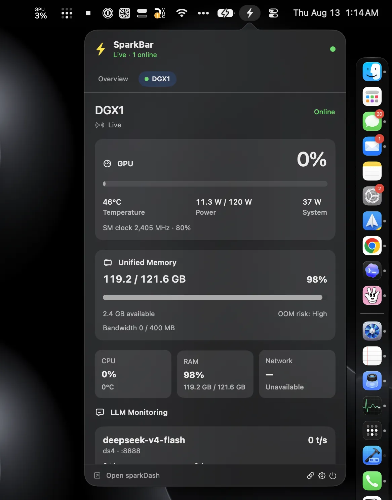

# SparkBar

A native macOS menu-bar companion for [sparkDash](https://github.com/MiaAI-Lab/sparkDash) that keeps your DGX Spark metrics one glance away.

<p align="center">
  
</p>

> **A signed DMG is coming very, very soon.** Until it lands, [build from source](#quick-start) — it takes about two minutes.

## What it is

SparkBar lives in your menu bar and streams live DGX Spark snapshots over WebSocket: GPU utilization and temperature, unified memory pressure, power draw, and LLM throughput. No SSH, no shell commands, no agent on the box — it is deliberately read-only and consumes only `GET /api/sparks` for connection validation and a single `WS /ws` stream for live data.

- The menu bar item shows the live metric you choose — GPU utilization, temperature, unified memory, LLM tokens/sec, or GPU + temperature — and switches to a warning icon when a Spark alerts. Right-click it for **Open sparkDash**, **Settings**, and **Quit**.
- The popover shows an overview of all Sparks, per-Spark detail pages (GPU, unified memory, network, storage, LLM and ComfyUI monitoring, Hermes Agent updates), and a rolling GPU/memory history chart.
- If sparkDash is reachable over REST but its WebSocket is blocked, SparkBar keeps refreshing through `GET /api/sparks/:id/metrics` polling until the stream recovers.

## Quick start

### Prerequisites

- macOS 14 Sonoma or newer
- Xcode 26.6 / Swift 6.3, or a compatible Swift 6 toolchain
- A reachable [sparkDash](https://github.com/MiaAI-Lab/sparkDash) endpoint

### Build from source

```sh
git clone https://github.com/sambitcreate/sparkbar-mac-dgx.git
cd sparkbar-mac-dgx
swift build
./scripts/build-app.sh
open .build/Release/SparkBar.app
```

`build-app.sh` assembles the `.app` bundle; `swift build` alone is enough for development and testing.

### Run the tests

```sh
swift test
```

All networking, decoding, selection, formatting, history, and alert logic lives in `SparkBarCore`, so the suite runs without launching AppKit. The app target adds the `NSStatusItem`, the SwiftUI popover and settings window, launch-at-login, and notifications.

## Connect to sparkDash

SparkBar depends on a running [sparkDash](https://github.com/MiaAI-Lab/sparkDash) instance, which performs the DGX Spark collection and exposes the REST/WebSocket API that SparkBar monitors. On first launch SparkBar has no endpoint configured; click the menu bar icon and enter your sparkDash URL in the connection view. The recommended deployment is Docker:

```sh
git clone https://github.com/MiaAI-Lab/sparkDash.git
cd sparkDash
docker compose up --build -d
```

Then point SparkBar at your sparkDash address: `http://localhost:5555` when sparkDash runs on the same Mac, or `http://<host-ip>:5555` over LAN or Tailscale for a remote DGX. For a development checkout of sparkDash, use `npm install` followed by `npm run dev`. See the [sparkDash quick start](https://github.com/MiaAI-Lab/sparkDash#quick-start) for the complete setup and DGX configuration.

SparkBar accepts any `http://`, `https://`, `ws://`, or `wss://` base URL; HTTP maps to WS and HTTPS maps to WSS automatically.

### A note on HTTP

HTTP is enabled in the app bundle because sparkDash is commonly reached over a trusted LAN or Tailscale network. SparkBar is read-only and restricts itself to the monitoring REST endpoints and `/ws`. Use HTTPS/WSS or an authenticated reverse proxy when the endpoint is not on a trusted private network.

## Live smoke test

Check an endpoint without launching the app:

```sh
curl -i http://localhost:5555/api/sparks
curl -i http://localhost:5555/api/settings
swift run SparkBarSmoke http://localhost:5555
```

## CI, releases, and signing

- `CI` runs on pull requests and pushes to `main` on a macOS 26 runner: Swift test suite, packaged app build, and bundle validation. Changes to only `.md` files skip the verification job.
- `Release macOS` runs on every push to `main`, builds version `0.1.<run number>`, uploads the app as a workflow artifact, and publishes a GitHub release with a SHA-256 checksum.
- Releases are ad-hoc signed by default. With `MACOS_SIGNING_ENABLED=true` and the signing/notarization credentials configured, the same pipeline switches to Developer ID Application signing, Apple notarization, ticket stapling, and Gatekeeper verification — the path the upcoming signed DMG ships through.
- `Pullfrog` is available via manual workflow dispatch; add at least one provider key (e.g. `OPENAI_API_KEY`) as a repository Actions secret first. It is intentionally not attached to `pull_request`, so provider secrets are never exposed to fork code.

### Enable signed and notarized releases

The release workflow never exposes signing credentials to pull requests. To enable the signed path, add these repository secrets:

- `MACOS_CERTIFICATE_P12_BASE64` — base64 of a Developer ID Application `.p12` containing the certificate and private key
- `MACOS_CERTIFICATE_PASSWORD` — password used when exporting that `.p12`
- `APPLE_API_KEY_ID` — App Store Connect API key ID
- `APPLE_API_ISSUER_ID` — App Store Connect issuer ID
- `APPLE_API_PRIVATE_KEY_BASE64` — base64 of the App Store Connect `AuthKey_<key-id>.p8`

And these repository variables:

- `MACOS_SIGNING_IDENTITY` — the exact identity, e.g. `Developer ID Application: Your Name (TEAMID)`
- `MACOS_SIGNING_ENABLED` — `true`

Create the Developer ID Application certificate in [Apple Developer Certificates](https://developer.apple.com/help/account/certificates/create-developer-id-certificates), export it with its private key from Keychain Access, and create the App Store Connect API key from [Users and Access](https://appstoreconnect.apple.com/access/integrations/api). Never commit the `.p12`, `.p8`, certificate password, or API credentials. Apple requires Developer ID signing, hardened runtime, and a secure timestamp for notarized software; the workflow applies all three before submitting with `notarytool`.

See [CONTRIBUTING.md](CONTRIBUTING.md) for local verification commands and pull request expectations.
